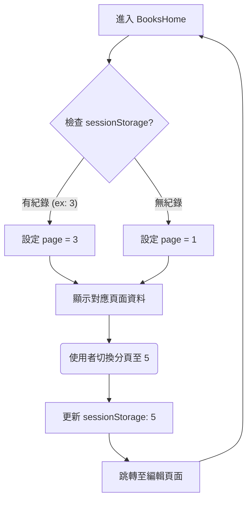

# Admin BookList DataTable UI 修改報告

**日期**: 2026-01-28  
**專案模組**: Bookstore Frontend / Admin / Books  
**技術堆疊**: Vue 3 (Composition API), Vuetify 3 (v-data-table)

---

## 1. 修改目標 (Objective)

**需求描述**:  
管理者在 `AdminBookList` (書籍管理列表) 頁面進行分頁瀏覽時 (例如瀏覽到第 3 頁)，點擊進入某本書的「修改」頁面，完成儲存並返回列表後，列表應**維持在原本的頁數** (第 3 頁)，而非重置回第一頁。

**解決方案**:  
利用瀏覽器的 `sessionStorage` 暫存當前頁碼，並在元件掛載 (`onMounted`) 時讀取還原。

---

## 2. 邏輯差異比較 (Logic Comparison)

### 修改前 (Before)

- **狀態管理**: `page` 狀態僅存在於 component 的記憶體中。
- **生命週期**: 當使用者導航離開 (如進入 `updateBook`) 再返回，`BooksHome.vue` 被銷毀並重新建立。
- **結果**: `page` 初始化為預設值 `1`，使用者迷失操作上下文。

### 修改後 (After)

- **狀態管理**: `page` 狀態同步至 `sessionStorage` (`adminBookListPage`)。
- **生命週期**:
  1.  `onMounted`: 檢查 `sessionStorage` 是否有值，若有則覆寫 `page`。
  2.  `watch(page)`: 當使用者切換分頁，立即更新 `sessionStorage`。
- **結果**: 頁碼狀態跨頁面跳轉得以保存。

### 資料流圖 (Data Flow)



---

## 3. 重點程式碼比較 (Code Diff)

檔案位置: `src/views/admin/books/BooksHome.vue`

```diff
  <script setup>
- import { ref, onMounted } from 'vue';
+ import { ref, onMounted, watch } from 'vue';

  // ... 其他變數宣告
  const loading = ref(false);
  const search = ref('');
+ const page = ref(1);

+ // [新增] 讀取已儲存的頁碼
+ const savedPage = sessionStorage.getItem('adminBookListPage');
+ if (savedPage) {
+     page.value = parseInt(savedPage, 10);
+ }

+ // [新增] 監聽頁碼變動並儲存
+ watch(page, (newPage) => {
+     sessionStorage.setItem('adminBookListPage', newPage);
+ });

  // ...

  <template>
      <!-- ... -->
      <v-data-table
+         v-model:page="page"
          :headers="headers"
          :items="books"
          <!-- ... -->
      >
```

---

## 4. 專家建議 (Architect Suggestions)

以資深軟體架構師視角，針對此修改提供以下建議與優化方向：

### 1. 狀態存儲選擇 (Storage Strategy)

本次採用 `sessionStorage` 是正確的選擇，原因如下：

- **生命週期合適**: `sessionStorage` 隨分頁 (Tab) 關閉而清除。若使用 `localStorage`，使用者下次 (隔天) 開啟網頁時仍停留在舊頁數，可能造成困惑。
- **實作輕量**: 無需引入 Vuex/Pinia 即可快速解決單一 View 的狀態保留問題。

### 2. 進階優化：URL Query Parameters

- **建議**: 若希望能讓使用者「分享」特定頁數的連結給同事 (例如: "請看第 5 頁的庫存")，則建議改將頁碼同步到 URL Query (如 `/admin/books?page=5`)。
- **優點**: 前後頁導航 (Browser Back/Forward) 體驗更原生。
- **缺點**: 需處理 Vue Router 的 `replace` 邏輯，實作複雜度稍高。目前方案對內部管理系統已足夠。

### 3. 快取清理時機 (Cache Invalidation)

- **潛在問題**: 當使用者點擊侧邊欄的「書籍管理」重新進入時，可能期望看到第一頁，但因 `sessionStorage` 還在，仍會停留在舊頁數。
- **建議**: 可在 Sidebar 的連結點擊事件中加入清除 `sessionStorage` 的邏輯，或是在 `beforeRouteEnter` 中判斷來源路由，若是從「非編輯頁面」進入，則重置頁碼。

### 4. 搜尋條件保留 (Search State Persistence)

- **觀察**: 目前僅保留 `page`。若使用者有輸入 `search` 關鍵字，返回後搜尋關鍵字會消失，但頁碼可能停留在第 N 頁 (若搜尋結果不足 N 頁會導致 DataTable 空白或自動修正)。
- **建議**: 建議下一步將 `search` 關鍵字也一併寫入 `sessionStorage`，確保「搜尋 + 分頁」的完整狀態還原。

```javascript
// 範例：同時保留搜尋關鍵字
const search = ref(sessionStorage.getItem("adminBookListSearch") || "");
watch(search, (newVal) =>
  sessionStorage.setItem("adminBookListSearch", newVal),
);
```
