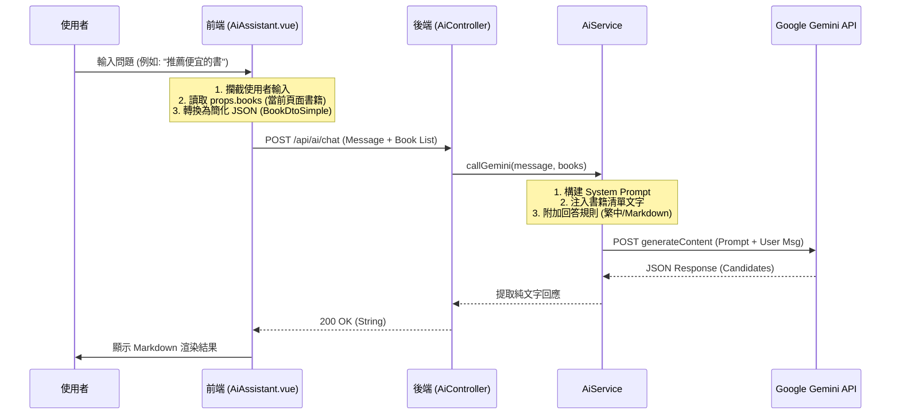

# BookStore AI 模組技術與擴展評估報告

## 1. 模組概觀與技術堆疊 (Module Overview & Technology Stack)

本報告針對 `BookStore` 專案中現行的 AI 購書顧問功能進行分析。目前該功能定位為「當前頁面上下文感知 (Context-Aware)」的輔助工具，主要服務於書籍列表頁面。

### 技術架構 (Tech Stack)

- **Frontend**: Vue 3 (Composition API), `markdown-it` (渲染回應), `Vuetify` (UI 組件).
- **Backend**: Java Spring Boot.
- **AI Provider**: Google Gemini API (Model: `gemini-2.5-flash` 依程式碼所示，推測為最新或測試版模型標識).
- **Communication**: REST API (`POST /api/ai/chat`), `OkHttp` Client.
- **Data Format**: JSON (Context Injection).

---

## 2. 資料流與邏輯架構 (Data Flow & Architecture)

目前的架構採用 **前端注入上下文 (Frontend Context Injection)** 模式。意即 AI 沒有直接存取資料庫的能力，而是依賴前端將「當前使用者看得到的書籍」作為背景知識傳送給 AI。

### 邏輯流程圖 (Mermaid)



### 關鍵邏輯差異說明 (Current vs Traditional)

- **傳統 Chatbot**: 通常由後端維護 Session，並由後端自行去資料庫撈取資料。
- **現行 BookStore AI**: **無狀態 (Stateless)** 且 **被動接收資料**。AI 只知道前端當下傳給它的那幾本書。這使得實作非常輕量，但限制了 AI 的視野（它看不到分頁以外、或者是尚未加載的書籍）。

---

## 3. 重點程式碼分析 (Core Code Analysis)

### 前端：上下文提取 (`AiAssistant.vue`)

前端的核心職責不僅是 UI，還包含 Data Mapping。

```javascript
// src/views/public/books/AiAssistant.vue (L51-56)
// 重點：只提取 AI 需要的欄位，減少 Payload 大小，避免 Token 浪費
const contextBooks = props.books.map((b) => ({
  bookName: b.bookName,
  author: b.author,
  price: b.price,
  shortDesc: b.shortDesc || "",
}));
```

> **點評**: 這是正確的優化。若直接傳送完整的後端 Entity (包含 ID, 圖片 URL, 創建時間等無意義資訊)，會大幅增加 Token 消耗與延遲。

### 後端：提示詞工程 (`AiService.java`)

後端負責將結構化資料 (JSON List) 轉譯為自然語言提示詞 (System Prompt)。

```java
// src/main/java/bookstore/service/AiService.java (L34-46)
StringBuilder context = new StringBuilder();
context.append("你是『BookStore』的專業購書顧問...庫存書籍清單回答：\n");

// 動態注入上下文 (Dynamic Context Injection)
if (books != null) {
    for (BookDtoSimple b : books) {
        // 將物件轉為自然的敘述句，讓 LLM 更好理解
        context.append(String.format("- 書名:%s, 作者:%s, 價格:%d, 簡介:%s\n", ...));
    }
}
// 硬性規則 (Guardrails)
context.append("\n規則：\n1. 若使用者詢問的問題超出清單範圍，請禮貌告知...\n");
```

> **點評**: 使用 System Prompt 規範 AI 行為是標準做法。特別是 Rule 1 (超出範圍告知) 非常重要，避免 AI 產生幻覺 (Hallucination) 去推薦不存在的書。

---

## 4. 全域擴展分析 (Global Expansion Analysis)

若目標是將此功能擴展為 **「全站 AI 助理」** (不僅限於當前列表，而是能回答所有書籍、訂單狀態、活動資訊)，目前的架構 **完全不可行**，必須重構。

### 4.1 擴展架構：RAG (檢索增強生成)

由於全站書籍可能成千上萬，無法像現在這樣一次塞進 API Request (會超過 Context Window 限制或極度昂貴)。必須採用 RAG 架構。

- **新資料流**:
  1.  User 提問。
  2.  後端將提問轉為向量 (Embedding)。
  3.  到向量資料庫 (Vector DB) 搜尋「最相關的 5-10 本書」或「相關規章」。
  4.  只將這 5-10 筆資料注入 Prompt 給 Gemini。

### 4.2 風險與成本評估

| 評估維度        | 風險項目         | 詳細說明                                                                                                                | 因應策略                                                                                   |
| :-------------- | :--------------- | :---------------------------------------------------------------------------------------------------------------------- | :----------------------------------------------------------------------------------------- |
| **經濟成本**    | Token 消耗激增   | 若不設限，全域對話上下文會非常長。Gemini 收費依 Token 計算。                                                            | 1. 限制對話輪數。<br>2. 實作 Cache (相同問題直接回)。<br>3. 使用較便宜的模型處理簡單意圖。 |
| **時間成本**    | 開發週期長       | 需建立資料同步機制 (DB 更新時同步更新 Vector DB)。                                                                      | 使用 Spring AI 或 LangChain4j 簡化開發。                                                   |
| **Server 負擔** | I/O Blocking     | 目前 `AiService` 使用 `callGemini` 是同步等待 (Blocking)。當多人同時聊天，Tomcat Thread Pool 會瞬間耗盡，導致全站卡住。 | **必須**改為 `WebFlux` (Reactive) 或 `CompletableFuture` 非同步處理。                      |
| **資安風險**    | Prompt Injection | 使用者可能誘導 AI 洩漏 System Prompt 或執行惡意指令。                                                                   | 加強 Prompt Guardrails，檢測惡意關鍵字。                                                   |

---

## 5. 資深工程師建議 (Senior Architect Recommendations)

### 短期優化 (針對現有模組)

1.  **錯誤處理增強**: 目前 `AiService` 的錯誤回傳是純文字。建議定義統一的 AI Exception，讓前端能根據錯誤碼顯示不同 UI (如：Quota Exceeded 顯示「顧問忙線中」)。
2.  **Streaming Response (流式回應)**: 目前使用者需等待整個回應生成完才看得到字。建議改用 **Server-Sent Events (SSE)**，讓文字一個字一個字打出來 (Typewriter effect)，大幅降低使用者的「體感延遲」。

### 全域擴展路線圖

若要邁向全域 AI，建議分三階段：

1.  **Phase 1 - 靜態知識庫**: 利用 RAG 讓 AI 能回答 FAQ (運費、退換貨)，這部分資料量小，不需要向量資料庫，一般 DB 關鍵字搜尋即可。
2.  **Phase 2 - 全庫書籍搜尋**: 引入 **Vector Search** (如 PostgreSQL `pgvector` 插件)，將書籍簡介向量化。當使用者問「推理小說」時，先語義搜尋找出 Top 10 書籍，再丟給 AI 介紹。
3.  **Phase 3 - 個人化助理**: 整合 User Table 與 Order Table，讓 AI 能回答「我上週買的書出貨了嗎？」。這需要極高的權限控管與 prompt 安全性設計。

### 遺留代碼修正建議

您目前的 `AiService.java` 中有一行 `GEMINI_API_URL` 包含 API Key 拼接：

```java
.url(GEMINI_API_URL + "?key=" + apiKey)
```

這是正確的，但建議將 Base URL 與參數分開管理，或使用 Spring 的 `UriComponentsBuilder` 確保編碼安全。此外，OkHttp Client 建議設為 Singleton Bean 並配置 Timeout (Connect/Read/Write)，避免網路卡住時 thread hang 住。
