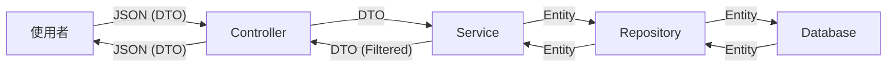

# BookClub 模組 DTO 重構修改計畫報告書

## 1. 專案目標 (Goal)

將 `BookClub` 相關功能從直接暴露 Entity (`BookClubsBean`) 重構為使用 DTO (`Data Transfer Object`) 模式，以強化資料安全性，隱藏敏感資訊，並解耦前後端資料結構。

## 2. 技術堆疊 (Tech Stack)

- **Backend**: Java Spring Boot
- **Database**: MSSQL (Based on provided schema)
- **Mapping**: MapStruct (推薦) 或 BeanUtils
- **Architecture**: Controller -> Service -> Repository

## 3. 核心差異比較 (Core Differences)

### 修改前 (Before)

- **資料傳輸**: Controller 直接接收與回傳 `BookClubsBean` (Entity)。
- **安全性**: `UserBean` (Host) 的所有欄位 (包括密碼雜湊、個人隱私資料) 可能隨著關聯被序列化並回傳給前端 (若未設定 `@JsonIgnore`)。
- **彈性**: 前端請求格式必須與資料庫資料表結構完全一致。

### 修改後 (After)

- **資料傳輸**:
  - 請求使用 `BookClubRequest` (僅包含建立/修改所需欄位)。
  - 回傳使用 `BookClubResponse` (列表用，精簡) 與 `BookClubDetailResponse` (詳情用，完整)。
- **安全性**: 僅回傳前端顯示所需的 `hostName` 或 `hostId`，徹底隱藏 `UserBean` 的敏感細節。
- **彈性**: DTO 可包含額外業務邏輯欄位 (如 `isFull`, `isJoined`)，無需修改資料庫結構。

### 資料流圖 (Data Flow)



## 4. 重點程式碼比較 (Code Diff)

### Controller 層差異

**Before:**

```java
@PostMapping("/insert")
public ResponseEntity<?> createClub(@RequestPart("bookclub") BookClubsBean bookclub, ...) {
    // 直接使用 Entity
    return ResponseEntity.ok(bookClubService.createBookClub(bookclub, ...));
}
```

**After:**

```java
@PostMapping("/insert")
public ResponseEntity<BookClubDetailResponse> createClub(@RequestPart("request") BookClubRequest request, ...) {
    // 轉換 DTO -> Entity
    BookClubsBean entity = mapRequestToEntity(request);
    BookClubsBean saved = bookClubService.createBookClub(entity, ...);
    // 轉換 Entity -> DTO
    return ResponseEntity.ok(mapEntityToResponse(saved));
}
```

## 5. 需隱藏的欄位 (Hidden Fields)

| 實體欄位 (Entity Field)     | 隱藏原因 (Reason)                                                            | DTO 對應處理                                    |
| :-------------------------- | :--------------------------------------------------------------------------- | :---------------------------------------------- |
| `host` (UserBean)           | **高風險**。包含 `password`, `email`, `phone`, `address` 等使用者個資。      | 僅回傳 `hostId`, `hostName`, `hostAvatar`。     |
| `rejectionReason`           | 內部審核註記，僅在特定狀態 (`REJECTED`) 下對發起人顯示，對一般瀏覽者應隱藏。 | 在 Response DTO 中根據權限動態填入或設為 Null。 |
| `aiEvaluation`              | 內部 AI 評估數據，可能包含敏感的權重或原始分析，非必要不需全數揭露。         | 僅回傳摘要或隱藏。                              |
| `created_at` / `updated_at` | 系統稽核欄位，前端展示非必要。                                               | 視需求回傳，通常可選。                          |

## 6. Service 與 Controller 修改評估

- **BookClubService**: **中度改動**。
  - 目前方法簽章多為 `BookClubsBean`。建議 Service 層維持處理 Entity，但在 Service 的進入點與回傳點需要適配 DTO，或者將 DTO 轉換層放在 Controller。
  - **建議**: 將 DTO <-> Entity 的轉換邏輯放在 `Controller` 或獨立的 `Mapper` 類別中，讓 Service 保持純淨 (專注於 Entity 操作)。這樣 Service 不需要大規模改寫，只需微調。

- **BookClubsController**: **大幅改動**。
  - 所有 Endpoint 的輸入參數需改為 `@RequestBody BookClubRequest` (或 multipart 的對應 DTO)。
  - 所有回傳型別需改為 `BookClubResponse`。

## 7. 架構師建議 (Architect Suggestions)

1.  **導入 Lombok 與 Mapper**: 使用 `MapStruct` 自動處理 Entity 與 DTO 的轉換，減少大量手工 `set/get` 程式碼，降低維護成本。
2.  **API 版本化**: 若此 API 已有外部串接，直接修改結構會破壞相容性。建議開 `/api/v2/clubs` 或確保前端同步更新。
3.  **Validation 分離**: 在 DTO 上使用 Java Bean Validation (`@NotNull`, `@Size`)，將資料格式驗證從 Service 邏輯中抽離，讓錯誤在 Controller 層就攔截。
4.  **查詢效能優化**: 目前 `BookClubsBean` 關聯了 `UserBean` (Host) 與 `BooksBean`。轉換 DTO 時需注意 N+1 查詢問題，建議在 Repository 層使用 `JOIN FETCH` 一次抓取所需的關聯資料。

---

**下一步**: 若您同意此計畫，我將開始建立 DTO 類別並重構 Controller。
