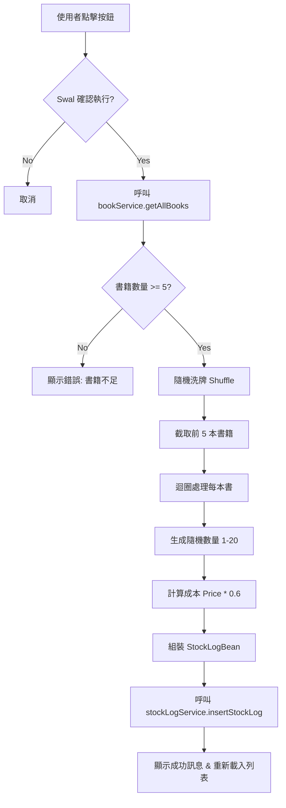

# Admin Logs One-Click Random Import 功能實作報告

**日期**: 2026-01-28  
**專案模組**: Bookstore Frontend / Admin / Logs  
**技術堆疊**: Vue 3 (Composition API), SweetAlert2, Axios

---

## 1. 修改目標 (Objective)

**需求描述**:  
在進貨管理頁面 (`AdminLogs`) 新增「一鍵隨機進貨」功能，以加速測試或是快速建立展示數據。

**功能規格**:

1.  **觸發方式**: 點擊「一鍵隨機進貨」按鈕。
2.  **選品邏輯**: 從現有書籍資料庫中，隨機挑選 5 本不重複的書籍。
3.  **數量產出**: 每本書隨機產生 1 至 20 本的進貨量。
4.  **成本計算**: 成本價自動設定為該書售價的 0.6 倍 (Cost = Price \* 0.6)。
5.  **廠商設定**: 自動標註廠商為「一鍵輸入測試廠商」。

---

## 2. 邏輯差異比較 (Logic Comparison)

### 修改前 (Before)

- **進貨流程**: 使用者需點擊「新增進貨單」 -> 跳轉至 `InsertStockLog` 頁面 -> 手動選擇廠商 -> 手動逐一加入書籍 -> 手動輸入數量與成本 -> 儲存。
- **測試效率**: 建立一筆包含 5 項商品的測試單據約需 1-2 分鐘的操作時間。

### 修改後 (After)

- **進貨流程**: 使用者點擊「一鍵隨機進貨」 -> 確認對話框 -> 系統自動完成所有步驟。
- **測試效率**: 建立相同規模單據僅需 < 3 秒。

### 資料流圖 (Data Flow)



---

## 3. 重點程式碼比較 (Code Diff)

檔案位置: `src/views/admin/logs/StockLogsHome.vue`

```diff
  <script setup>
+ import bookService from '@/api/bookService.js';

  // ... (略)

+ // [新增] Fisher-Yates Shuffle 演算法實作隨機挑選
+ const getRandomSubarray = (arr, size) => {
+     const shuffled = arr.slice(0);
+     let i = arr.length;
+     // ... 洗牌邏輯
+     return shuffled.slice(0, size);
+ };

+ // [新增] 一鍵隨機進貨主邏輯
+ const generateRandomLog = async () => {
+     // ... Swal 確認視窗
+
+     // 1. 取得全書籍
+     const bookResponse = await bookService.getAllBooks();
+
+     // 2. 隨機挑選 & 3. 建構資料
+     const selectedBooks = getRandomSubarray(allBooks, 5);
+     const stockLogDetailBeans = selectedBooks.map(book => ({
+         bookId: book.bookId,
+         quantity: Math.floor(Math.random() * 20) + 1,
+         costPrice: Math.floor(book.price * 0.6)
+     }));
+
+     // 4. 送出資料
+     const stockLogData = {
+         wholesaler: '一鍵輸入測試廠商',
+         stockType: 1,
+         stockLogDetailBeans: stockLogDetailBeans
+     };
+     await stockLogService.insertStockLog(stockLogData);
+     // ...
+ };
  </script>

  <template>
      <!-- ... -->
      <div class="d-flex gap-2">
          <v-btn ...>新增進貨單</v-btn>
+         <v-btn color="secondary" prepend-icon="mdi-flash" size="large" @click="generateRandomLog" elevation="2">
+             一鍵隨機進貨
+         </v-btn>
      </div>
```

---

## 4. 專家建議 (Architect Suggestions)

以資深軟體工程師視角，針對目前實作提供以下建議：

1.  **後端整合 (Backend Integration)**:
    - 目前隨機選品邏輯在前端實作 (`getAllBooks` 後在前端 shuffle)。若書籍數量極大 (如 10 萬本)，此舉會造成前端效能與網路頻寬在傳輸大量無用數據。
    - **優化建議**: 建議後端實作 `/api/stockLog/random-generate` 接口，將隨機邏輯移至資料庫層 (`ORDER BY RAND() LIMIT 5`)，前端僅需發送一個指令請求即可。

2.  **參數化配置 (Configurability)**:
    - **優化建議**: 若此功能常用，可設計一個簡單的 Dialog 讓使用者輸入「要幾本書」、「數量範圍」、「指定廠商名稱」，提升工具的靈活性。

3.  **安全性 (Security)**:
    - **注意**: 確保後端 API 有驗證 `costPrice` 的合理性 (雖是隨機生成，但不應為負數)。目前前端已有 `Math.floor` 處理，但建議在後端也加上可容忍的誤差檢查，此功能僅限於開發/測試環境 (`dev` 路由下) 使用。
