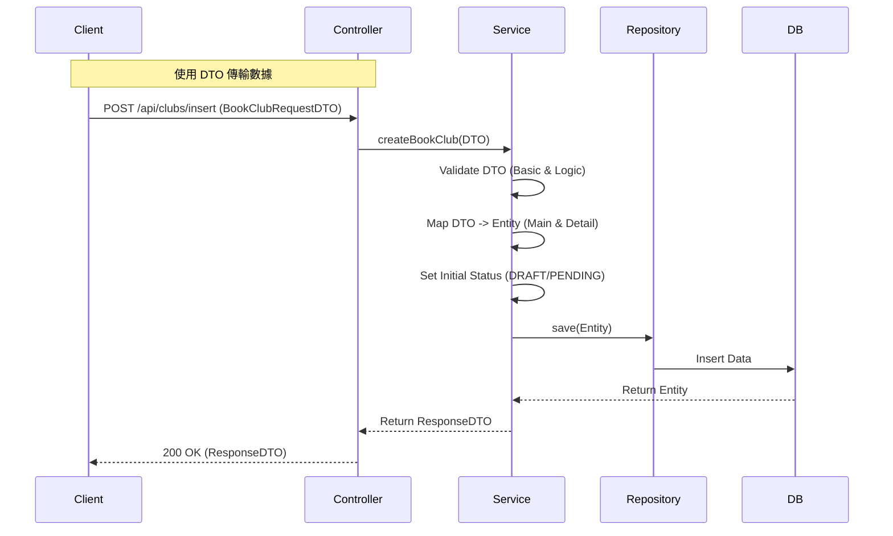

# BookClub 模組完整檢查報告

## 1. 檢核範圍與技術架構 (Scope & Architecture)

本報告針對 `BookClub` 模組進行代碼與流程檢核，對照提供的流程圖（State Machine），分析 Bean、DTO、Service 邏輯、Controller 層與 Repository 層的完整性與正確性。

- **技術棧**: Spring Boot, Spring Data JPA, Lombok
- **檢核目標**: 確保業務邏輯符合流程圖設計，修復現有代碼中的邏輯漏洞與編譯錯誤。

---

## 2. 核心邏輯差異說明 (Logical Differences)

### 2.1 現況分析 (Before)

目前代碼存在嚴重的**邏輯斷層**與**編譯/運行錯誤**：

1.  **Controller 與 Service 簽章不符**: `BookClubsController` 的 `updateClub` 接收 `BookClubsBean` (Entity)，但 Service 卻要求 `BookClubRequestDTO`，這會導致編譯錯誤或運行時錯誤。
2.  **狀態機邏輯缺陷**: `VaidatePermissionAndState` 方法邏輯錯誤，目前僅允許狀態為 `PENDING` (審核中) 時進行修改，直接導致 **DRAFT (草稿)** 狀態無法被編輯，與流程圖「草稿 -> 填寫完成」的邏輯相悖。
3.  **功能缺失**:
    - `insert` (新增) 方法在 Controller 中直接返回 `null`，完全未實作。
    - 流程圖中的 **「審核 (核准/拒絕/駁回)」** 與 **「取消」** 功能在 Service 中完全缺失。
4.  **Entity 結構鬆散**: `BookClubsBean` 與 `ClubDetail` 雖然邏輯上是主附表，但在 Entity 關聯設定上較為鬆散（單向關聯），且 Controller 回傳列表時未包含 Detail 資訊，前端將無法顯示完整活動細節。

### 2.2 修正建議 (After)

建議進行以下架構調整：

1.  **全面 DTO 化**: Controller 層一律接收與回傳 DTO，Service 層負責 `DTO <-> Entity` 的轉換，避免將 Entity 暴露給前端。
2.  **修正狀態驗證**: 允許 `DRAFT` (草稿) 與 `REJECTED` (駁回) 狀態進行編輯；`PENDING` (審核中) 應鎖定不可編輯。
3.  **補全狀態機方法**: 新增 `approve()`, `reject()`, `cancel()` 等方法以符合流程圖。
4.  **排程任務**: 流程圖中「時間 > 截止時間 -> 截止」等邏輯，建議透過 Spring `@Scheduled` 任務自動執行，而非僅依賴觸發。

### 2.3 修正後架構流程圖 (Proposed Architecture Flow)



---

## 3. 關鍵代碼比對 (Key Code Comparison)

### 3.1 Controller 層 - 更新邏輯 (Update Logic)

**🔴 修改前 (錯誤/無法編譯):**

```java
// BookClubsController.java
@PutMapping("/update/{clubId}")
public ResponseEntity<?> updateClub(
    @PathVariable Integer clubId,
    @RequestPart("data") BookClubsBean clubdata, // 錯誤：直接接收 Entity
    ...
) {
    // ...
    // 錯誤：Service 預期 DTO，這裡傳入 Entity
    BookClubsBean club = bookClubService.updateBookclub(clubId, clubdata, userId, userRole);
    return ResponseEntity.ok(club);
}
```

**🟢 修改後 (建議):**

```java
@PutMapping("/update/{clubId}")
public ResponseEntity<BookClubResponseDTO> updateClub(
    @PathVariable Integer clubId,
    @RequestPart("data") BookClubRequestDTO dto, // 正確：接收 DTO
    ...
) {
    // Service 處理轉換並回傳 ResponseDTO
    BookClubResponseDTO response = bookClubService.updateBookclub(clubId, dto, userId, userRole);
    return ResponseEntity.ok(response);
}
```

### 3.2 Service 層 - 狀態權限檢查 (Permission Check)

**🔴 修改前 (邏輯漏洞):**

```java
// BookClubService.java
public boolean VaidatePermissionAndState(...) {
    // ...
    } else if (status != ClubConstants.STATUS_PEDING) {
        // 錯誤：如果狀態是 DRAFT (7)，不等於 PENDING (0)，直接拋錯
        // 導致草稿無法被編輯
        throw new BusinessException(400, "目前狀態無法進行修改");
    }
    // ...
}
```

**🟢 修改後 (修正):**

```java
public void validatePermissionAndCheckState(...) {
    // ...
    // 允許編輯的狀態：草稿 (DRAFT) 或 駁回 (REJECTED)
    boolean isEditable = (status == ClubConstants.STATUS_DRAFT || status == ClubConstants.STATUS_REJECTED);

    if (!isEditable) {
         throw new BusinessException(400, "僅有草稿或駁回狀態可進行修改");
    }
    // PENDING (審核中) 應鎖定不可修改
}
```

---

## 4. 模組檢查詳細報告 (Detailed Inspection)

### 1. Bean 的對應關係 (Bean Mapping)

- **現況**: `BookClubsBean` 與 `ClubDetail` 關聯正確但實作鬆散。Service 手動維護兩者存檔。
- **問題**: `organizerType` 使用 `Short` 較為罕見，建議統一使用 `Integer`。
- **建議**: 雖然目前手動維護尚可運行，但建議在 `BookClubsBean` 加入 `@OneToOne(mappedBy = "mainClub", cascade = CascadeType.ALL)` 以便於未來級聯操作。

### 2. DTO 的轉換 (DTO Conversion)

- **問題**: `BookClubRequestDTO` 設計混合了 Action (控制欄位) 與資料欄位。
- **缺失**: 缺乏 `BookClubResponseDTO`。目前直接回傳 Entity，會導致 `hibernateLazyInitializer` 等欄位洩漏（雖然已有 `@JsonIgnoreProperties`），且無法一次回傳 Main + Detail 的完整資訊。
- **建議**: 建立 `BookClubResponseDTO`，包含 `BookClubRequestDTO` 的所有欄位加上 `clubId`, `status`, `rejectionReason` 等系統生成欄位。

### 3. Service 驗證邏輯 (Service Logic)

- **冗長驗證**: `validateFullClubDetail` (新增時) 與 `validateFileds` (更新時) 邏輯高度重複。
- **流程缺陷**: 缺乏針對流程圖中 **Admin Approve/Reject** 與 **Member Cancel** 的方法。目前代碼僅有 `deleteClubId` (物理刪除)，不符合流程圖中的「已取消」狀態 (邏輯刪除)。
- **建議**:
  1. 實作 `cancelClub(Integer clubId)`：將狀態設為 `STATUS_CANCELLED`。
  2. 實作 `reviewClub(Integer clubId, boolean pass, String reason)`：管理員審核用。

### 4. Controller 修改需求 (Controller Changes)

- **新增**: 必須補完 `/api/clubs/insert` 實作。
- **修改**: `/update` 簽章修正為使用 DTO。
- **擴充**: `/my-hosted` 需確認是否需要分頁。
- **新接口**: 需要新增 `/api/clubs/{clubId}/review` (管理員用) 與 `/api/clubs/{clubId}/cancel` (會員用)。

### 5. Repository 檢查 (Repository Check)

- **現況**: `BookClubsRepository` 基本正確。
- **缺失**: 缺少針對「過期自動關閉」的查詢方法，例如 `findByStatusAndEventDateBefore(Integer status, LocalDateTime date)`。

---

## 5. 專家綜合建議 (Expert Suggestions)

1.  **使用 MapStruct**: 目前手動 `set/get` 轉換代碼冗長且易錯。建議引入 **MapStruct** 自動處理 DTO <-> Entity 轉換。
2.  **狀態模式 (State Pattern)**: 由於狀態流轉複雜（草稿、審核、退回、額滿、截止），建議將狀態流轉邏輯封裝至獨立的 `StateService` 或使用 State Pattern，避免 `BookClubService` 充斥大量的 `if-else`。
3.  **邏輯刪除**: 除非必要，應避免 `deleteById`。流程圖中的「取消」應為更新狀態至 `STATUS_CANCELLED`。
4.  **前後端分離數據完整性**: 讀取單筆讀書會 (`getClub`) 時，務必回傳包含 `ClubDetail` (宗旨、議程) 的完整 DTO，否則前端頁面會一片空白。

請確認是否需要我針對上述修正建議，直接提供修復後的代碼檔案（Service, Controller, DTO）？
