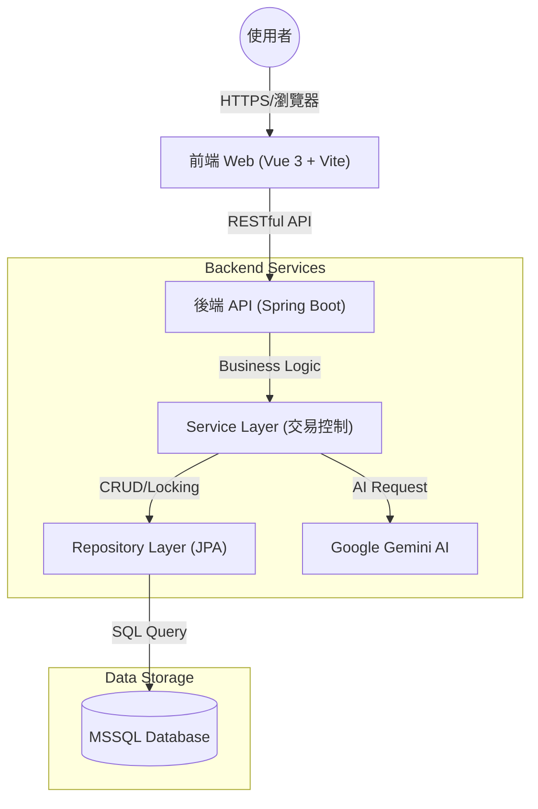

# 🌲 Forest Bookstore - 全方位書店管理與社群平台

[](https://vuejs.org/)
[](https://spring.io/projects/spring-boot)
[](https://vuetifyjs.com/)
[](https://www.microsoft.com/sql-server)

## 📖 專案簡介 (Introduction)

**Forest Bookstore** 是一個整合「電子商務」與「社群讀書會」的現代化書店管理系統。不同於傳統的 CRUD 練習，本專案致力於解決**高併發場景下的庫存一致性問題**，並透過引入 **Google Gemini AI** 提升用戶互動體驗。

我們的目標是打造一個既能滿足書籍銷售需求，又能連結讀者社群的生態系，並確保在高流量活動（如讀書會熱門報名、限量書籍搶購）下，系統數據依然精確無誤。

---

## 🛠️ 技術堆疊 (Tech Stack)

### Frontend (前端)
- **Core**: Vue 3 (Composition API, Script Setup)
- **Build Tool**: Vite 5 (極速開發體驗)
- **UI Framework**: Vuetify 3 (Material Design 風格, 自訂森林系主題)
- **State Management**: Pinia (模組化狀態管理)
- **Routing**: Vue Router 4 (動態路由與權限守衛)
- **API Client**: Axios (攔截器處理全域錯誤與 Token 驗證)

### Backend (後端)
- **Framework**: Spring Boot 3.4.1 (Java 17)
- **ORM**: Spring Data JPA (Hibernate)
- **Database**: Microsoft SQL Server
- **Security**: JWT (JSON Web Token) 身份驗證
- **AI Integration**: Google Gemini API
- **Utilities**: Lombok, WebSocket

---

## 🏗️ 系統架構 (System Architecture)

本專案採用經典的前後端分離架構，確保職責單一與維護性。



---

## ✨ 核心功能 (Key Features)

### 1. 🛒 智慧電商模組
- **完整購物流程**: 從購物車、結帳到訂單歷史查詢。
- **即時庫存檢查**: 下單時自動檢核庫存，避免超賣。
- **優惠券系統**: 支援折扣碼應用與金額試算。

### 2. 📚 讀書會社群 (Social Club)
- **活動發起與審核**: 會員可發起讀書會，管理員後台審核。
- **高併發報名機制**: 引入樂觀鎖 (Optimistic Locking) 防止熱門活動人數超收。
- **互動討論**: 結合線下活動資訊與線上報名管理。

### 3. 🤖 AI 智能助手
- **即時客服**: 整合 Google Gemini，回答書籍相關問題。
- **個性化推薦**: 根據用戶提問推薦適合的書籍。

### 4. 📊 庫存與日誌管理
- **精確進銷存**: 記錄每一筆庫存變動（進貨、退貨、銷售）。
- **悲觀鎖保護**: 在進退貨操作中使用 `SELECT FOR UPDATE`，確保庫存數據強一致性。

---

## 🚀 技術難點與解決方案 (Challenge & Solution)

### Challenge 1: 讀書會名額超收 (Overbooking)
**情境**: 當讀書會僅剩 1 個名額，A 與 B 兩位使用者同時按下「報名」，傳統檢查邏輯可能導致兩人同時寫入成功，造成名額溢出。

**Solution: 樂觀鎖 (Optimistic Locking)**
我們在 `BookClubsBean` 中引入 `@Version` 版本號控制。
- 當 A 與 B 讀取時，version 皆為 1。
- A 先寫入成功，version 變為 2。
- B 嘗試寫入時，發現資料庫 version 已非 1，拋出 `OptimisticLockingFailureException`。
- **結果**: 系統捕捉異常並提示 B「報名失敗，請重試」，有效防止超收，且不影響資料庫效能。

### Challenge 2: 庫存數據並發衝突 (Lost Update)
**情境**: 管理員正在後台進行「進貨」操作（讀取庫存 10 -> 準備 +5），同時前台有訂單生成（讀取庫存 10 -> 準備 -1）。若無鎖，最後結果可能變成 15 或 9，而非正確的 14。

**Solution: 悲觀鎖 (Pessimistic Locking)**
在庫存變動的關鍵路徑（如 `StockLogService`），我們使用 JPA 的 `PESSIMISTIC_WRITE` 鎖定模式。
- `SELECT ... FOR UPDATE` 確保同一時間只有一個交易能讀取並修改特定書籍的庫存。
- **結果**: 雖然犧牲了少許並發效能，但對於「庫存」這類高價值數據，保證了絕對的準確性 (Strong Consistency)。

<!-- --- -->

<!-- ## 🆚 邏輯差異分析 (Before & After)

| 比較項目 | Before (一般學生專題) | After (Forest Bookstore - 本專案) |
| :--- | :--- | :--- |
| **專案定位** | 單純的 CRUD 資料紀錄工具 | 具備商業邏輯與社群互動的平台 |
| **並發處理** | 無 (多使用者同時操作會出錯) | **混合鎖機制** (樂觀鎖 + 悲觀鎖) 確保數據一致 |
| **資料驗證** | 僅前端簡單檢查 | **前後端雙重驗證** + 資料庫層級約束 |
| **使用者體驗** | 傳統表單，操作繁瑣 | **一鍵填入** (Smart Input) 測試工具、即時 AI 助手 |
| **代碼架構** | 邏輯散落在 Controller | 嚴格分層 (Controller/Service/Repo)，符合 OOP 原則 |
| **錯誤處理** | 每個 try-catch 隨意處理 | **全域異常處理 (Global Exception Handler)** 統一回傳格式 | -->

---

## 🏃 如何啟動 (Installation & Run)

### Backend
1. Clone 專案並導入 IDE (IntelliJ/Eclipse)。
2. 確認 `application.properties` 中的資料庫連線設定。
3. 執行 `BookstoreApplication.java` 啟動 Spring Boot。

### Frontend
```bash
# 進入前端目錄
cd bookstore-frontend

# 安裝依賴
npm install

# 啟動開發伺服器
npm run dev
```

瀏覽器打開 `http://localhost:5173` 即可開始使用。

### Automated Testing (自動化測試)
本專案包含 Cypress E2E 測試腳本，用於演示核心流程。

```bash
# 開啟 Cypress 測試介面
npx cypress open
```
選擇 **E2E Testing** -> **Chrome** -> 點擊 `book_club_flow.cy.js` 開始測試。


---

*Authored by Senior Software Engineer Team*
*Last Updated: 2026/02/09*
